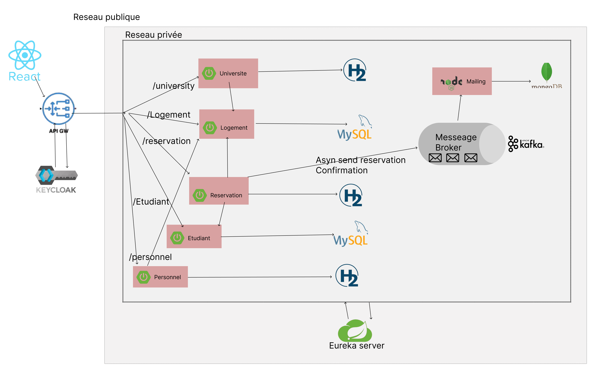

# Student Accommodation Microservices System
A microservices-based application for managing student accommodations across universities and dormitories. 
This system handles the management of students, universities, dormitory buildings, rooms, and reservations, ensuring efficient and secure housing operations.

## Table of Contents
- [Features](#features)
- [Tech Stack](#tech-stack)
- [Architecture Diagram](#architecture-diagram)
- [Prerequisites](#prerequisites)
- [Getting Started](#getting-started)
- [Keycloak Setup](#keycloak-setup)

## Features
- University management
- Student management
- Reservation management
- Dormitory buildings, blocks, and room management
- Single Sign-On (SSO) with OpenID Connect
- Role-Based Access Control (RBAC)


## Tech Stack


## Architecture Diagram

*This diagram illustrates the high-level microservices architecture, including API Gateway, Auth via Keycloak, and communication between services.*

## Prerequisites
* Docker
* Git

## Getting Started
These instructions will get you a copy of the project up and running on your local machine.
### Installation
1. Clone the repository:
``` 
    git clone https://github.com/MedEzzedineBenZbiba/4Twin1-JS-Ninjas-student-accommodation-MS.git 
```
2. Navigate into the project directory:
 ```
   cd 4Twin1-JS-Ninjas-student-accommodation-MS
 ```
### Run the project 
1. Run the docker-compose file :
```
    docker-compose up -d
```
### Keycloak Setup
1. Open [Keycloak Admin Console](http://localhost:8180/)
2. Create a new **Realm** (e.g., `student_accommodation`)
    - Or update the `application.yml` file to match your Realm name
3. Create roles (e.g., `admin`, `user`)
4. Create users and assign roles


